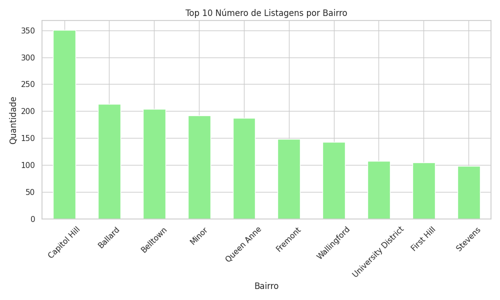

# Airbnb Analysis - Seattle

## Objetivo
Analisar as listagens do Airbnb em Seattle para descobrir padrões de preço, disponibilidade e avaliações por bairro.  
Este projeto foi desenvolvido usando Python, pandas e seaborn, e os insights podem ajudar a entender tendências de preços e popularidade de bairros.

## Ferramentas Utilizadas
- Python
- pandas
- seaborn
- matplotlib

## Principais Insights
1. **Preço médio por bairro:**  
   - Alguns bairros possuem preços médios significativamente mais altos, indicando regiões premium.  
   - Outros bairros têm preços mais acessíveis, sugerindo opções para diferentes perfis de hóspedes.

2. **Número de listagens por bairro:**  
   - O Bairro Capitol hill possui o maior número de listagens, enquanto o Bairro Stevens tem poucas opções.  
   - Isso mostra a concentração de imóveis e a popularidade de determinados bairros.

3. **Correlação preço x número de avaliações:**  
   - A correlação é baixa, indicando que imóveis caros não necessariamente recebem mais avaliações.  
   - Imóveis com preço médio tendem a ter avaliações mais consistentes.

4. **Disponibilidade média por bairro:**  
   - Alguns bairros têm imóveis disponíveis quase o ano inteiro, enquanto outros apresentam disponibilidade limitada.  
   - Isso pode indicar sazonalidade ou imóveis destinados a estadias longas.

## Gráficos

